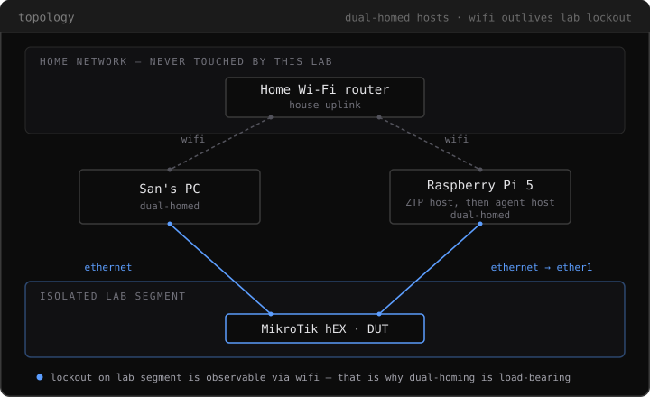

# netops-lab

A personal MikroTik + Raspberry Pi home lab. The driving goal: get real,
hands-on zero-touch provisioning (ZTP) experience on hardware I own. Once
ZTP is proven, the same rig becomes the substrate for a second experiment —
can an agent operating on a live router avoid locking itself out.

## Goal

Power on a factory-blank MikroTik router, touch nothing, and watch it come up
fully configured — via DHCP-based ZTP. That sequencing is deliberate: a
reliable wipe-to-provisioned cycle is the experimental harness that makes the
later agent experiment repeatable. Without it, every lockout is a manual
rebuild.

**Write-up:** [Zero-Touch Provisioning](https://sanlee.me/projects/netops-lab.html)
— what was built, the finding that every real barrier to running it unattended
was on the *host* rather than the device, and what it explicitly does not
establish. This repo is the working record behind it: decisions in
[decisions/](decisions/), and what actually broke in
[docs/bring-up-notes.md](docs/bring-up-notes.md).

## Hardware

| Device | Role |
|---|---|
| MikroTik hEX refresh, E50UG (RouterOS 7, ARM 32-bit, 512MB RAM, 128MB NAND) | device under test |
| Raspberry Pi 5, 8GB, NVMe boot | ZTP / Netinstall host, then agent host |

The router is deliberately the cheap end of MikroTik's lineup — see
[decisions/002](decisions/002-keep-the-hex-decline-rb5009.md) for why a
pricier router was considered and declined. It *can* run RouterOS containers
(ARM, though only 128MB of NAND), but all container workloads — FRR, syslog
viewer, future agent runtime — live on the Pi by design, never the router:
the Pi is the dual-homed agent host, and hosting the agent on the device it
might sever would defeat the lockout observation. See
[decisions/003](decisions/003-on-router-containers.md).

### Bring-up kit

What the Pi build actually used, recorded after the fact (2026-07-25).

| Item | Role |
|---|---|
| Argon NEO 5 M.2 NVMe case | Enclosure *and* NVMe carrier — replaces a separate M.2 HAT; ships its own PCIe ribbon and screws. Single-sided SSDs only. |
| Ranxiana NVMe SSD, M.2 2280 | Root filesystem — enumerates as `nvme0n1`, 238.5G usable |
| Precision Phillips PH0 | Case and carrier screws (Greenworks 6pc precision set) |
| USB flash drive, 64GB | Install medium, then rescue image — see below |
| Pi 5 PSU, 27W USB-C PD | Power |

**No microSD was involved.** The Pi installed from the USB stick, which is
kept afterward as a known-good rescue image for this machine — worth more
here than a spare drive, in a lab whose premise is out-of-band recovery.

How the bring-up actually went, including the two things that would have cost
an evening if hit blind, is logged in
[docs/bring-up-notes.md](docs/bring-up-notes.md).

## WireGuard + house uplink (item 2)

Designed in [decisions/009](decisions/009-wireguard-endpoint-and-uplink.md).
**Live on hardware 2026-08-11** (home-LAN path verified: PC WireGuard →
`ping 10.99.0.1` and `ping 192.168.88.1`). Field notes, key layout, and the
failure modes that burned time:
[docs/bring-up-notes.md — 2026-08-11](docs/bring-up-notes.md#2026-08-11--wireguard-endpoint-live-house-uplink-on-ether5).

| Piece | Where |
|---|---|
| ether5 house uplink, DHCP client, NAT masquerade, UDP/51820 accept | `provisioning/default-config.rsc` (survives wipe) |
| `wg-lab` tunnel + San peer | `provisioning/apply-wireguard.sh` (keys on Pi only) |
| Auto re-apply after wipe | `reprovision.sh` calls apply when `~/.config/netops-lab/wg-lab.private` exists |

**Placement:** Pi + hEX sit by the house/VZ router (short cables: Pi→ether1,
ether5→VZ LAN). PC stays on house wifi only — no long run to the desk.
Pi SSH user is `sanlee@goguma`.

```bash
# on goguma — keys never in git
mkdir -p ~/.config/netops-lab && chmod 700 ~/.config/netops-lab
# server private → ~/.config/netops-lab/wg-lab.private  (mode 600, full ~44-char key)
# laptop public  → ~/.config/netops-lab/wg-client-san.public  # must match PC client.private
chmod +x ~/netops-lab/provisioning/apply-wireguard.sh
./provisioning/apply-wireguard.sh
# home test Endpoint = <ether5 bound address>:51820  (not hairpin via public IP)
# off-site: VZ UDP 51820 → ether5 address + Endpoint = public IPv4:51820
```

After key changes, confirm alignment before blaming the firewall:

```bash
ssh lab-router '/interface wireguard print proplist=name,public-key,listen-port'
ssh lab-router '/interface wireguard peers print proplist=interface,public-key,allowed-address'
# PC: Get-Content client.private -Raw | & "C:\Program Files\WireGuard\wg.exe" pubkey
```

## Topology

<p align="center">
  <picture>
    <source media="(prefers-color-scheme: dark)" srcset="images/topology-dark.svg">
    <source media="(prefers-color-scheme: light)" srcset="images/topology-light.svg">
    
  </picture>
</p>

The Pi is deliberately dual-homed: one interface on the isolated lab segment,
one on the house wifi. When an agent severs the Pi's lab-segment link, the
wifi session survives — so the lockout is observable from inside the agent's
own host, instead of requiring physical access to recover.

The Pi's single NIC lands on **ether1** because that's the port the hEX
netinstalls from — which puts the Pi on what the stock configuration treats
as the WAN side, behind a firewall that drops input from WAN. Opening
management for the Pi on ether1 is therefore part of the provisioning script
itself, and the same surface the lockout experiment later attacks. See
[decisions/005](decisions/005-pi-as-ztp-host.md).

## Why hardware, not a simulator

Tools like containerlab are free and better for topology *volume*. This lab
is about *fidelity*: bare-metal bring-up, out-of-band recovery, and
management-plane behavior that a simulator abstracts away — exactly the
parts that are hardest to get right without hands-on practice. See
[decisions/001](decisions/001-hardware-substrate-scope.md).

## Roadmap

Sequenced, not exhaustive — this is what's ordered so far. Backlog below is
real but unscheduled.

1. ~~**ZTP + Netinstall closure**~~ — **working, 2026-07-26.** Netinstall-driven,
   hosted on the Pi, with the provisioning script arming the next cycle so
   wipes stay repeatable —
   [decisions/005](decisions/005-pi-as-ztp-host.md),
   [decisions/006](decisions/006-management-surface-on-ether1.md),
   [decisions/008](decisions/008-unattended-wipe-cycle.md)
2. ~~**WireGuard endpoint + house uplink**~~ — **live 2026-08-11** (home-LAN
   path). RouterOS-native `wg-lab` on the hEX, house uplink on ether5, keys on
   the Pi — [decisions/009](decisions/009-wireguard-endpoint-and-uplink.md),
   bring-up
   [notes](docs/bring-up-notes.md#2026-08-11--wireguard-endpoint-live-house-uplink-on-ether5).
   Off-site Endpoint (VZ port-forward + public IPv4) still to confirm.
3. FRR / OSPF-BGP on the Pi
4. Netwatch-driven self-lockout experiment
5. Remote syslog off-box (so router logs survive the router going unreachable)

**Backlog (decided as real additions, not yet ordered):**
- Certificate authority — hands-on version of the RFC 8572 / BRSKI trust
  model this lab's ZTP work is grounded in
- VLAN segmentation
- The Dude monitoring
- Pi hosting `kb-agent` persistently
- k8s as a CNI/BGP networking lab (pod routing, network policy, Calico
  peering with the hEX) — the one k8s scenario judged not to be ceremony;
  parked pending a clear multi-node need, since the cheap path there is
  VMs/kind on the desktop, not more physical hardware

The failure mode to watch for: a beautifully configured router and no ZTP
writeup. Everything below item 1 waits until item 1 actually ships.

## Status

Hardware ordered 2026-07-22, all in hand 2026-07-25.

Two bring-up sessions that day. The PC is on the router's segment, and the Pi
(`goguma`) is built — booting from NVMe, headless on wifi, EEPROM current.
That closes the hardware substrate gate on everything below.

**Roadmap item 1 works.** On 2026-07-26 a wiped board went from
factory-blank to fully configured on **one power cycle** — no button hold, no
console, no serial adapter. `netinstall-cli` runs on the Pi under user-mode
QEMU, serving BOOTP and TFTP on the lab link and pushing
[provisioning/default-config.rsc](provisioning/default-config.rsc), whose
management surface is decided in
[decisions/006](decisions/006-management-surface-on-ether1.md). The Pi then
authenticates to the provisioned router by SSH key, through the single
firewall exception the script wrote for it.

A repeat cycle is one command on the Pi followed by a reboot of the router —
[provisioning/reprovision.sh](provisioning/reprovision.sh) — and
`ssh lab-router "/system resource print"` then answers with no prompt of any
kind. RouterOS does demand an interactive password change on first login, but
it is interactive-only and a non-interactive session never meets it.

That reboot does **not** have to be a power cycle, and it is no longer done by
hand. RouterBOOT runs its `boot-device` logic on every boot, so
`ssh lab-router "/system reboot"` reaches Etherboot exactly as pulling the plug
does — verified 2026-08-03. The script arms the board, starts the server, waits
until it is genuinely listening, reboots the router into it, and verifies the
result. One command, nothing physical, and a run marked `ok` now means the
router answered afterwards rather than only that the installer exited zero.
See [decisions/008](decisions/008-unattended-wipe-cycle.md), including the cost
accepted: one command wipes hardware with no confirmation, and the preflight
that refuses to wipe the router you are reached through is what carries that.

Two physical actions remain, both bounded. A *factory* board still needs the
reset-button hold and a one-time device-mode update, because it ships unable to
be armed at all. And a router that is already unreachable cannot be rebooted
over the management path that is broken — so that branch asks for a power cycle
rather than failing, which is the case Netinstall exists for.

What that cost, and it is worth knowing before repeating this: the barriers to
running unattended were not on the router at all. They were SSH host-key
verification and a key passphrase **on the Pi**, invisible until something
non-interactive tried to run. Zero-touch moved to the host driving it rather
than being achieved outright, and the Pi's `ssh-agent` still needs a human
after a reboot — a limitation that lands on item 4 and is recorded in
[decisions/006](decisions/006-management-surface-on-ether1.md).

**Settled 2026-08-03, and it changed the picture.** The open question was
whether the script's arming line ran or whether `boot-device` merely persisted
through the format. It ran — Netinstall reaches setup mode by Etherbooting,
which *consumes* the one-shot and reverts the stored value, so persistence
could never have explained the armed reading taken after the cycle.

The finding that mattered more came with it: **the arm is single-use.** Any
boot spends it, server listening or not, so a provisioned router offers itself
to Netinstall for exactly one boot and then quietly stops. This board was
already sitting at RouterBOOT's default when the question was reopened, which
means the repeat cycle described above would not have worked without re-arming
first. That is a real limit on the recovery path roadmap item 4 depends on, and
it is why the cycle should arm immediately before rebooting rather than trust an
arm set at provision time.

Both were settled with a soft reboot and nothing listening, which cost one
command rather than the wipe cycle originally proposed. The full run, including
the failures along the way and the reasoning error that kept the question open
for a week, is in [docs/bring-up-notes.md](docs/bring-up-notes.md).

## Bring-up notes

[docs/bring-up-notes.md](docs/bring-up-notes.md) is the troubleshooting log
for physical bring-up — symptoms, what they meant, and what fixed them. It
already carries two things worth reading *before* cabling a machine onto the
lab segment: pinning the lab NIC's interface metric so the lab router can't
steal the default route, and disabling Energy Efficient Ethernet on the host
NIC, which is what kept the first PC ↔ hEX link from coming up at all.

## Decisions

See [decisions/](decisions/) for the ADR log.
