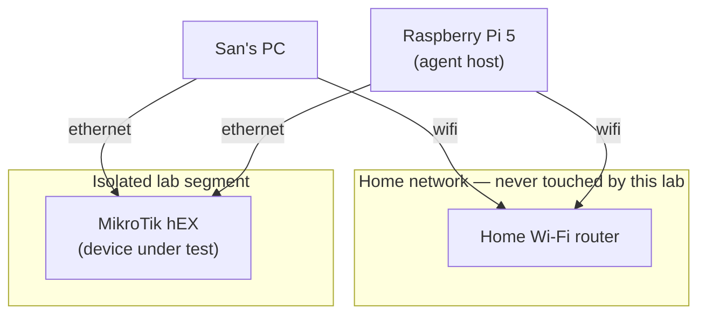

# netops-lab

A personal MikroTik + Raspberry Pi home lab. The driving goal: get real,
hands-on zero-touch provisioning (ZTP) experience on hardware I own. Once
ZTP is proven, the same rig becomes the substrate for a second experiment —
can an agent operating on a live router avoid locking itself out.

## Goal

Power on a factory-blank MikroTik router, touch nothing, and watch it come up
fully configured — via DHCP-based ZTP. That sequencing is deliberate: a
reliable wipe-to-provisioned cycle is the experimental harness that makes the
later agent experiment repeatable. Without it, every lockout is a manual
rebuild.

## Hardware

| Device | Role |
|---|---|
| MikroTik hEX (RouterOS, MMIPS) | device under test |
| Raspberry Pi 5, 8GB, NVMe boot | agent host |

The router is deliberately the cheap end of MikroTik's lineup — see
[decisions/002](decisions/002-keep-the-hex-decline-rb5009.md) for why a
pricier router was considered and declined. It's also container-incapable by
design (MMIPS, 16MB flash); all container workloads (FRR, syslog viewer,
future agent runtime) live on the Pi, never the router.

## Topology

The Pi is deliberately dual-homed: one interface on the isolated lab segment,
one on the house wifi. When an agent severs the Pi's lab-segment link, the
wifi session survives — so the lockout is observable from inside the agent's
own host, instead of requiring physical access to recover.

## Why hardware, not a simulator

Tools like containerlab are free and better for topology *volume*. This lab
is about *fidelity*: bare-metal bring-up, out-of-band recovery, and
management-plane behavior that a simulator abstracts away — exactly the
parts that are hardest to get right without hands-on practice. See
[decisions/001](decisions/001-hardware-substrate-scope.md).

## Roadmap

Sequenced, not exhaustive — this is what's ordered so far. Backlog below is
real but unscheduled.

1. **ZTP + Netinstall closure** — first deliverable, gates everything below
2. WireGuard endpoint (RouterOS 7 native — pays back every day this lab
   isn't physically reachable)
3. FRR / OSPF-BGP on the Pi
4. Netwatch-driven self-lockout experiment
5. Remote syslog off-box (so router logs survive the router going unreachable)

**Backlog (decided as real additions, not yet ordered):**
- Certificate authority — hands-on version of the RFC 8572 / BRSKI trust
  model this lab's ZTP work is grounded in
- VLAN segmentation
- The Dude monitoring
- Pi hosting `kb-agent` persistently
- k8s as a CNI/BGP networking lab (pod routing, network policy, Calico
  peering with the hEX) — the one k8s scenario judged not to be ceremony;
  parked pending a clear multi-node need, since the cheap path there is
  VMs/kind on the desktop, not more physical hardware

The failure mode to watch for: a beautifully configured router and no ZTP
writeup. Everything below item 1 waits until item 1 actually ships.

## Status

Hardware ordered 2026-07-22, all in hand 2026-07-25. First bring-up session
that same day got the PC onto the router's segment; ZTP (roadmap item 1) is
not started.

## Bring-up notes

[docs/bring-up-notes.md](docs/bring-up-notes.md) is the troubleshooting log
for physical bring-up — symptoms, what they meant, and what fixed them. It
already carries two things worth reading *before* cabling a machine onto the
lab segment: pinning the lab NIC's interface metric so the lab router can't
steal the default route, and disabling Energy Efficient Ethernet on the host
NIC, which is what kept the first PC ↔ hEX link from coming up at all.

## Decisions

See [decisions/](decisions/) for the ADR log.
