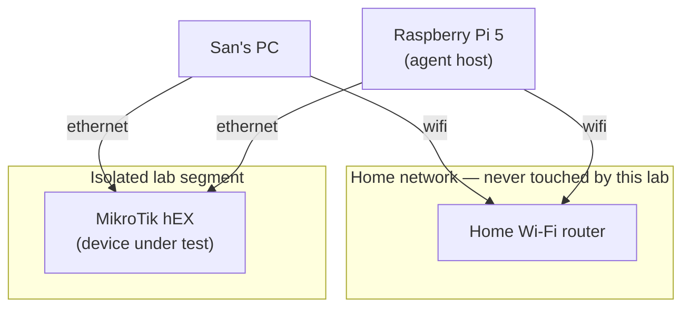

# netops-lab

A personal MikroTik + Raspberry Pi home lab. The driving goal: get real,
hands-on zero-touch provisioning (ZTP) experience on hardware I own. Once
ZTP is proven, the same rig becomes the substrate for a second experiment —
can an agent operating on a live router avoid locking itself out.

## Goal

Power on a factory-blank MikroTik router, touch nothing, and watch it come up
fully configured — via DHCP-based ZTP. That sequencing is deliberate: a
reliable wipe-to-provisioned cycle is the experimental harness that makes the
later agent experiment repeatable. Without it, every lockout is a manual
rebuild.

## Hardware

| Device | Role |
|---|---|
| MikroTik hEX (RouterOS, MMIPS) | device under test |
| Raspberry Pi 5, 8GB, NVMe boot | agent host |

The router is deliberately the cheap end of MikroTik's lineup — see
[decisions/002](decisions/002-keep-the-hex-decline-rb5009.md) for why a
pricier router was considered and declined. It's also container-incapable by
design (MMIPS, 16MB flash); all container workloads (FRR, syslog viewer,
future agent runtime) live on the Pi, never the router.

### Bring-up kit

Consumables and tools, so bring-up day doesn't stall on a hardware-store run.

| Item | Needed for | Status |
|---|---|---|
| Precision Phillips **PH0** | Pi 5 case screws, M2.5 HAT standoffs | Have — Greenworks 6pc precision set, 2026-07-25 |
| Precision Phillips **PH00** | M2 retaining screw on the NVMe drive | Likely in the same set — sizes not all confirmed; M.2 HAT kits usually ship the screw themselves |
| 2× ethernet patch cable | PC→hEX and Pi→hEX per the topology above | Unverified |
| microSD card | Pi first boot / bootloader update before NVMe boot works | Unverified |
| Pi 5 PSU (27W USB-C PD) | Pi 5 draws more than a Pi 4 supply provides | Unverified |

"Unverified" means not yet checked against what's actually on hand — not
that it's missing. Confirm before the build rather than during it.

## Topology

The Pi is deliberately dual-homed: one interface on the isolated lab segment,
one on the house wifi. When an agent severs the Pi's lab-segment link, the
wifi session survives — so the lockout is observable from inside the agent's
own host, instead of requiring physical access to recover.

## Why hardware, not a simulator

Tools like containerlab are free and better for topology *volume*. This lab
is about *fidelity*: bare-metal bring-up, out-of-band recovery, and
management-plane behavior that a simulator abstracts away — exactly the
parts that are hardest to get right without hands-on practice. See
[decisions/001](decisions/001-hardware-substrate-scope.md).

## Roadmap

Sequenced, not exhaustive — this is what's ordered so far. Backlog below is
real but unscheduled.

1. **ZTP + Netinstall closure** — first deliverable, gates everything below
2. WireGuard endpoint (RouterOS 7 native — pays back every day this lab
   isn't physically reachable)
3. FRR / OSPF-BGP on the Pi
4. Netwatch-driven self-lockout experiment
5. Remote syslog off-box (so router logs survive the router going unreachable)

**Backlog (decided as real additions, not yet ordered):**
- Certificate authority — hands-on version of the RFC 8572 / BRSKI trust
  model this lab's ZTP work is grounded in
- VLAN segmentation
- The Dude monitoring
- Pi hosting `kb-agent` persistently
- k8s as a CNI/BGP networking lab (pod routing, network policy, Calico
  peering with the hEX) — the one k8s scenario judged not to be ceremony;
  parked pending a clear multi-node need, since the cheap path there is
  VMs/kind on the desktop, not more physical hardware

The failure mode to watch for: a beautifully configured router and no ZTP
writeup. Everything below item 1 waits until item 1 actually ships.

## Status

Hardware ordered 2026-07-22, arrives / pickup-ready 2026-07-25. Build not
started — this repo is scaffolding ahead of the hardware landing.

## Decisions

See [decisions/](decisions/) for the ADR log.
